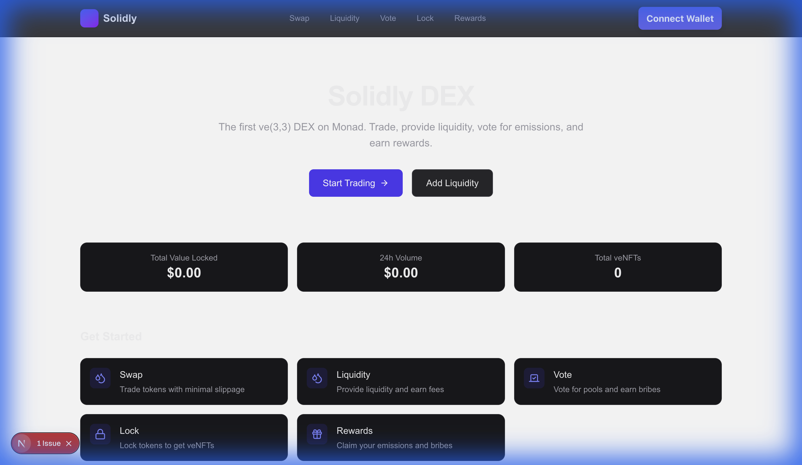
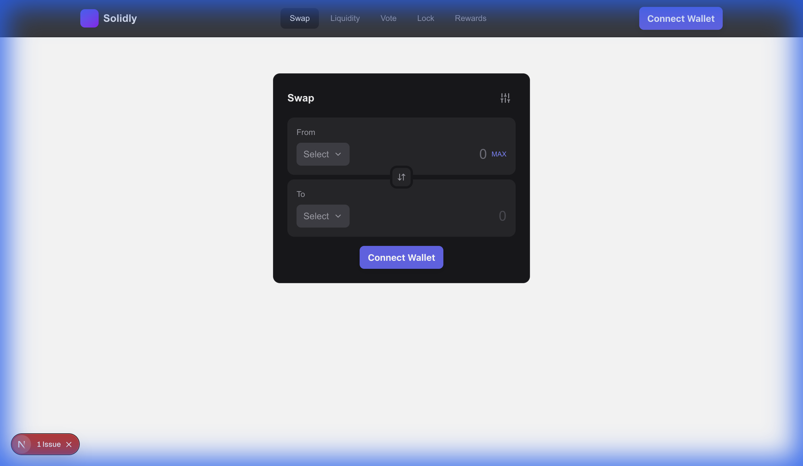
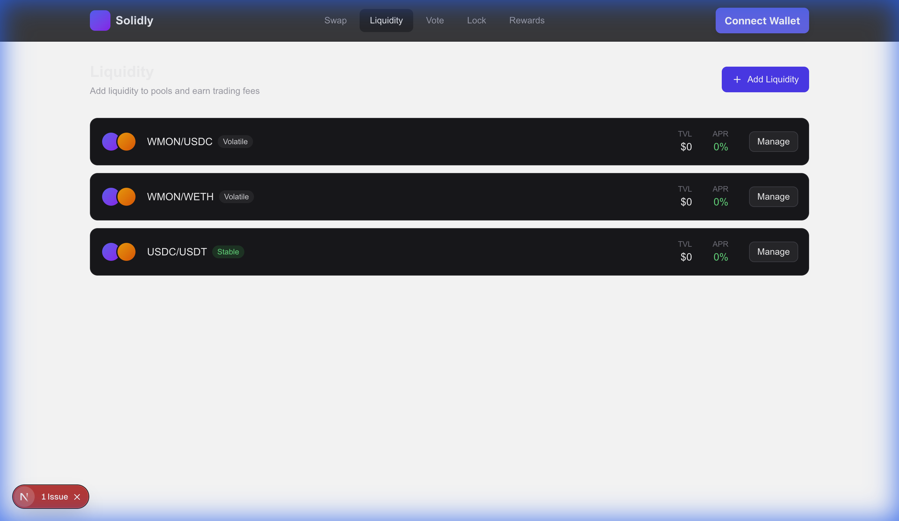
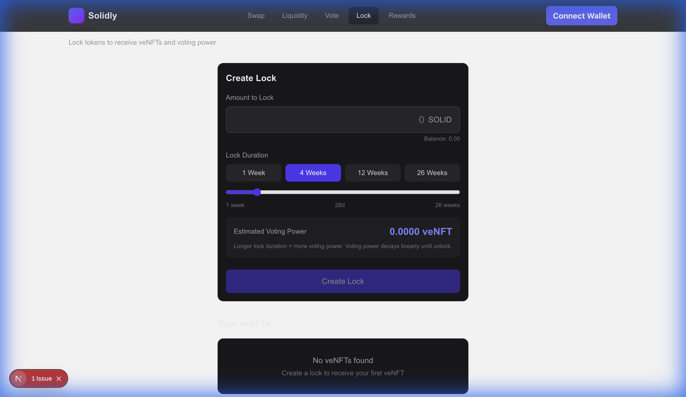
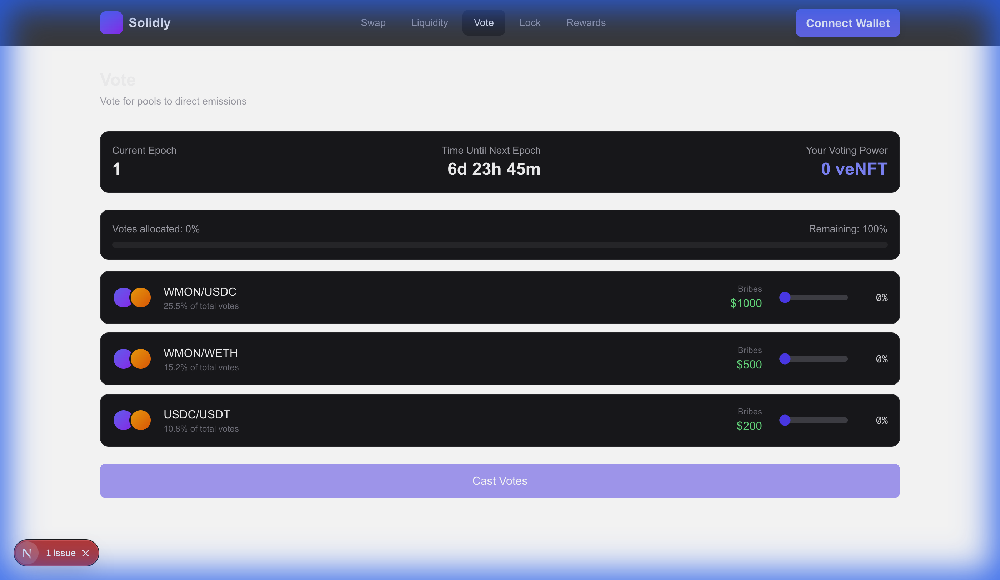

# Solidly DEX on Monad

A production-ready ve(3,3) decentralized exchange built for the Monad blockchain.



## Features

- **Token Swaps**: Trade any ERC-20 token with optimal routing
- **Liquidity Pools**: Provide liquidity to stable and volatile pairs
- **Vote-Escrowed NFTs (veNFT)**: Lock tokens to receive voting power
- **Gauge Voting**: Direct emissions to your preferred pools
- **Bribes**: Earn additional rewards for your votes
- **Rewards**: Claim trading fees, emissions, and bribes

## Screenshots

<details>
<summary>View Screenshots</summary>

### Swap Interface


### Liquidity Pools


### Lock & veNFT


### Voting


</details>

## Tech Stack

| Package | Technologies |
|---------|-------------|
| **Contracts** | Solidity 0.8.9, Foundry, Hardhat |
| **Web** | Next.js 14, TypeScript, Tailwind CSS, wagmi v3, RainbowKit |
| **API** | Hono, Viem, TypeScript |

## Getting Started

### Prerequisites

- Node.js >= 20
- pnpm >= 9
- Foundry (for contracts)

### Installation

```bash
# Clone the repository
git clone https://github.com/yourusername/solidly-custom.git
cd solidly-custom

# Install dependencies
pnpm install

# Set up environment variables
cp web/.env.example web/.env.local
# Edit web/.env.local with your values
```

### Development

```bash
# Run web development server
pnpm dev:web

# Run API server
pnpm dev:api

# Build contracts
cd contracts && forge build
```

## Project Structure

```
solidly-custom/
├── contracts/          # Solidity smart contracts
│   ├── src/            # Contract source files
│   ├── test/           # Foundry tests
│   └── script/         # Deployment scripts
├── web/                # Next.js frontend
│   ├── src/app/        # App router pages
│   ├── src/components/ # React components
│   ├── src/hooks/      # Custom hooks
│   └── src/lib/        # Utilities and config
├── api/                # Hono API server
│   └── src/            # API routes and services
└── docs/               # Documentation
```

## Configuration

### Environment Variables

Create `web/.env.local`:

```env
NEXT_PUBLIC_WALLETCONNECT_PROJECT_ID=your_project_id
NEXT_PUBLIC_CHAIN_ID=143
NEXT_PUBLIC_RPC_URL=https://rpc.monad.xyz
```

Get a WalletConnect Project ID at https://cloud.walletconnect.com

### Monad Network

| Network | Chain ID | RPC URL |
|---------|----------|---------|
| Mainnet | 143 | https://rpc.monad.xyz |
| Testnet | 10143 | https://testnet-rpc.monad.xyz |

## Scripts

| Command | Description |
|---------|-------------|
| `pnpm install` | Install all dependencies |
| `pnpm dev:web` | Start web dev server |
| `pnpm dev:api` | Start API dev server |
| `pnpm build` | Build all packages |
| `pnpm test` | Run contract tests |

## Contract Addresses

Addresses will be updated after deployment to Monad.

| Contract | Address |
|----------|---------|
| Token | TBD |
| VotingEscrow | TBD |
| Router | TBD |
| PairFactory | TBD |
| Voter | TBD |

## Deployment

Contract deployment instructions coming soon.

## License

MIT
